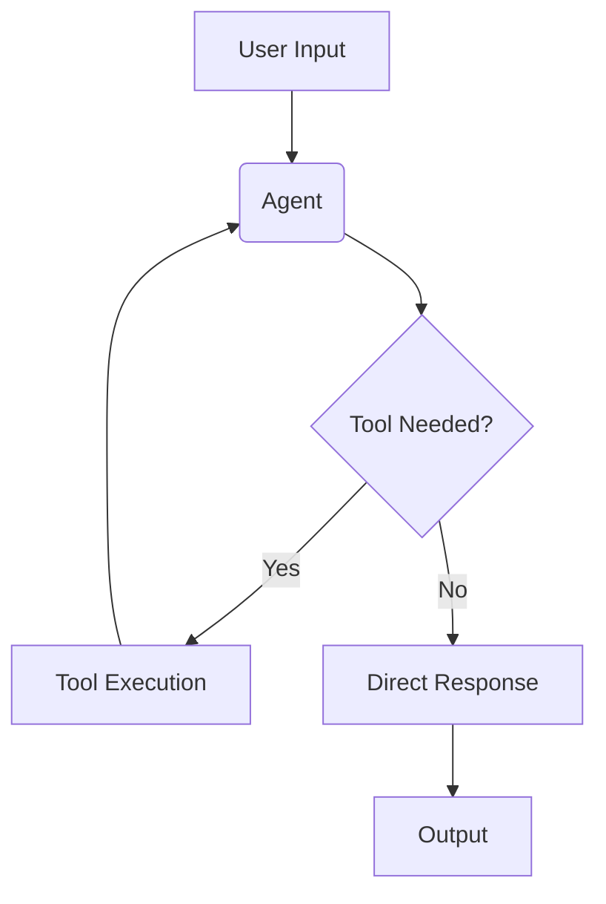

# AI Agent with Gmail and Web Tools Integration


A sophisticated AI agent powered by Google's Gemini that can manage emails, perform web searches, and analyze web content through natural language commands. The agent features both a command-line interface and a modern Streamlit web interface.

## 🌟 Features

### Email Management
- ✉️ **Gmail Integration**
  - Search and retrieve emails using natural language queries
  - Compose and send professional emails
  - Smart email formatting and validation
  - Secure OAuth 2.0 authentication

### Web Capabilities
- 🔍 **Web Search**
  - Google Custom Search API integration
  - Intelligent result parsing and formatting
  - Configurable number of search results
- 🌐 **Web Content Analysis**
  - URL scraping and content extraction
  - Smart content summarization
  - Key points extraction
  - Clean HTML parsing

### User Interface
- 💻 **Dual Interface Options**
  - Command-line interface for quick access
  - Modern Streamlit web interface
  - Real-time tool usage feedback
  - Conversation history management

### Smart Features
- 🤖 **Intelligent Tool Selection**
  - Context-aware tool selection
  - Natural language command processing
  - Error handling and recovery
- 🔒 **Security**
  - Secure credential management
  - Environment variable protection
  - OAuth 2.0 authentication

## 📋 Prerequisites

- Python 3.10 or higher
- Google Cloud account
- Gemini API key
- Google Custom Search API credentials

## 🚀 Installation

1. Clone the repository:
```bash
git clone git@github.com:ramzijebalia/ai-agent.git
cd ai-agent
```

2. Install dependencies:
```bash
pip install -r requirements.txt
```

3. Set up your environment variables in `.env`:
```env
# Gemini API
GOOGLE_API_KEY=your_api_key_here

# Google Custom Search
GOOGLE_CSE_API_KEY=your_search_api_key
GOOGLE_CSE_CX=your_search_engine_id

# Optional
USER_NAME="Your Name"
```

### API Setup Instructions

#### Gmail API Setup
1. Enable Gmail API in [Google Cloud Console](https://console.cloud.google.com)
2. Create OAuth 2.0 credentials (Desktop App type)
3. Download `credentials.json` and place it in your project root

#### Google Custom Search Setup
1. Create a Programmable Search Engine at [Google CSE](https://programmablesearchengine.google.com/about/)
2. Note your Search Engine ID (CX)
3. Enable Custom Search JSON API in Google Cloud Console
4. Create an API key

## 🎮 Usage

### Command Line Interface
```bash
python main.py
```

### Web Interface
```bash
streamlit run app.py
```

## 📊 Architecture



## 🛠️ Available Tools

1. **Email Tools**
   - `search_emails`: Search Gmail inbox
   - `send_email`: Compose and send emails

2. **Web Tools**
   - `google_search`: Perform web searches
   - `web_scraping`: Analyze webpage content

## 🤝 Contributing

Contributions are welcome! Please feel free to submit a Pull Request.

## 📝 License

This project is licensed under the MIT License - see the LICENSE file for details.

## 🙏 Acknowledgments

- Google Gemini API
- LangChain
- Streamlit
- BeautifulSoup4 